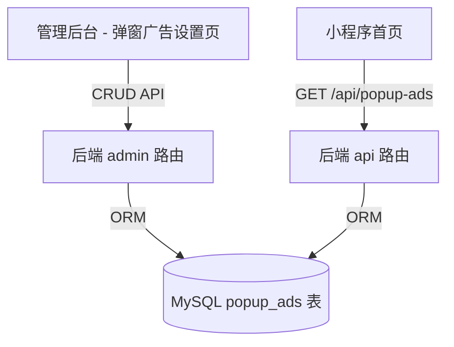

## 需求概述

在平台管理员后台新增一个独立的"弹窗广告设置"菜单项，支持管理员配置小程序页面弹窗广告。

## 核心功能

1. **管理后台独立菜单**：在侧边栏「内容管理」和「数据统计」之间新增「弹窗广告」菜单项
2. **弹窗广告配置表单**：1:1还原截图设计，包含以下配置项：

- 广告标题（文本输入框）
- 广告样式（单选：局部弹窗 / 全屏广告）
- 广告图片（最多3张，每张支持上传图片+配置跳转链接）
- 弹窗次数（单选：每次进入 / 仅首次）
- 生效时间（日期时间范围选择器）
- 排序（数字输入框）
- 状态（开关）

3. **后端 CRUD 接口**：支持弹窗广告的创建、编辑、删除、查询
4. **小程序端展示**：在首页展示弹窗广告，支持点击跳转链接

## 视觉要求

页面样式必须1:1还原截图中的「弹窗广告设置」界面，包括：

- 顶部标题"弹窗广告设置"
- 表单字段的排列顺序和布局
- 图片上传区域的样式（带预览和删除按钮，链接输入框）
- 底部保存按钮

## 技术栈

- **后端**: Node.js + Express + Sequelize + MySQL
- **管理后台前端**: Vue 3 + Element Plus + Vite
- **小程序端**: 原生微信小程序
- **文件上传**: 复用现有 `/api/admin/upload` 接口

## 实现方案

### 整体架构



### 核心设计决策

1. **复用 CRUD 工厂模式**：使用 `crud-factory.js` 的 `createCrudRouter` 生成标准 CRUD 路由，与 Banner/公告等保持一致
2. **独立页面非Tab**：创建独立页面 `views/popup-ad/index.vue`，在路由和侧边栏中作为独立菜单项
3. **截图还原**：页面主体为 el-card 包裹的 el-form，表单字段布局完全匹配截图
4. **图片上传**：复用现有 `/api/admin/upload` 接口，上传成功后获取URL填入表单
5. **小程序弹窗**：首页 onLoad 时请求当前启用的弹窗广告，使用原生弹窗组件展示

### 数据模型

```javascript
// PopupAd.js
PopupAd = {
  id: BIGINT PK AUTO_INCREMENT,
  title: STRING(100),                    // 广告标题
  popup_type: ENUM('local','fullscreen'), // 广告样式:局部弹窗/全屏广告
  images: JSON,                           // 图片配置 [{url, link}]
  show_frequency: ENUM('always','first'), // 弹窗次数:每次/仅首次
  sort_order: INTEGER DEFAULT 0,          // 排序
  status: TINYINT DEFAULT 1,               // 状态
  start_time: DATE,                        // 生效开始时间
  end_time: DATE,                          // 生效结束时间
  created_at, updated_at                  // 时间戳
}
```

### 前端页面结构

```
views/popup-ad/index.vue
├── el-card
│   ├── template #header: "弹窗广告设置"
│   └── el-form (label-width="120px")
│       ├── 广告标题: el-input
│       ├── 广告样式: el-radio-group (局部弹窗/全屏广告)
│       ├── 广告图片: 动态图片列表 (最多3张)
│       │   └── 每张:
│       │       ├── el-upload (图片上传+预览+删除)
│       │       └── el-input (跳转链接)
│       ├── 弹窗次数: el-radio-group (每次/仅首次)
│       ├── 生效时间: el-date-picker type="datetimerange"
│       ├── 排序: el-input-number
│       ├── 状态: el-switch
│       └── el-button "保存" (提交表单)
```

### 设计约束

- 菜单插入位置：内容管理（index="/content"）之后，数据统计（index="/statistics"）之前
- 图标：使用 Element Plus 的 `Notification` 图标
- 路由路径：`/popup-ad`
- 严格使用现有项目的底色（`#f0f2f5`）、字体、间距等视觉规范

## 性能与可靠性

- 小程序端缓存最近获取的弹窗配置，避免每次加载都请求
- 使用 wx.setStorageSync 记录用户已关闭弹窗，配合 show_frequency 控制展示逻辑
- 前后端双重校验生效时间范围

## 设计风格

严格遵循管理后台现有的 Element Plus 风格，与现有页面保持视觉一致性。

## 页面布局

整体为卡片式布局，表单在卡片内居中排列，标签在左、控件在右。

### 页头

- 面包屑导航：首页 / 弹窗广告设置
- 页面标题：弹窗广告设置（el-card header）

### 表单区域（1:1还原截图）

1. **广告标题**: 单行文本输入框，占满宽度
2. **广告样式**: 两个 Radio 按钮水平排列（局部弹窗、全屏广告）
3. **广告图片**: 动态列表，每项包含：

- 左侧：图片上传区域（含预览，尺寸建议 300x200px，圆角边框，虚线边框样式）
- 右侧上方：删除按钮（小号文字按钮）
- 右侧下方：跳转链接输入框
- 底部：添加图片按钮（最多3张）

4. **弹窗次数**: 两个 Radio 按钮水平排列（每次、仅首次）
5. **生效时间**: 日期时间范围选择器，宽度自适应
6. **排序**: 数字输入框，min=0
7. **状态**: 开关（Switch），开=启用，关=禁用

### 底部操作

- 保存按钮：蓝色主题色（type="primary"），居中或靠右对齐

## 色彩系统

- 遵循现有后台管理系统的 Element Plus 默认主题色
- 卡片背景：#FFFFFF
- 页面背景：#F0F2F5
- 标签文字：#606266
- 表单项间隔：22px

# Agent Extensions

无需使用额外的 Agent Extensions