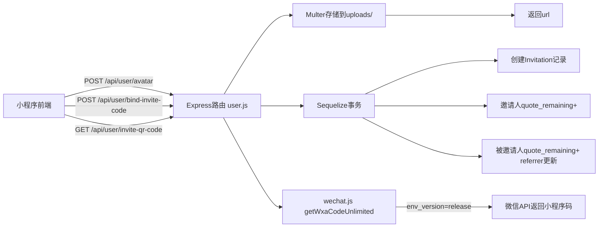

## 用户需求

### 问题1：头像上传404导致一直loading

小程序端选择头像后一直显示loading状态，接口 `POST /api/user/avatar` 返回404。

### 问题2：我的页面增加绑定邀请码功能

在「我的」页面「邀请好友」入口旁边增加「绑定邀请码」按钮，点击后跳转到绑定邀请码页面，用户输入邀请码提交后获得奖励。**双方都得到奖励**：输入者本人（被邀请人）和邀请码拥有者（邀请人）各获得报价次数奖励。

### 问题3：邀请好友页面二维码类型

邀请好友页面当前生成的是普通二维码，需要改为微信小程序原生小程序码（圆形放射状码）。

## 产品概述

数码回收小程序的三个修复与功能增强：修复头像上传接口缺失导致的loading卡死问题；新增绑定邀请码功能页面实现双方奖励；修正小程序码生成环境配置使其生成微信原生小程序码。

## 核心功能

- 头像上传：新增后端 `/avatar` 上传路由，修复前端 uploadFile 异常处理
- 绑定邀请码：新页面 + 后端接口，校验邀请码有效性，双方发放报价次数奖励
- 小程序码：修正 .env 环境版本配置为 release，使微信原生小程序码 API 正常工作

## 技术栈

- 后端：Node.js + Express.js + Sequelize (MySQL) + Multer (文件上传)
- 小程序：微信原生小程序（WXML/WXSS/JS）
- 微信API：getwxacodeunlimited（小程序码生成）

## 实现方案

### 问题1：头像上传404修复

**根因**：前端 `api-modules.js:43` 调用 `POST /user/avatar`，但服务端 `routes/api/user.js` 无此路由 → 404。`api.js:88` 的 `uploadFile` 在 success 回调中直接 `JSON.parse(res.data)`，404返回HTML页面导致parse抛异常，异常在success回调内部未被Promise reject捕获 → Promise永久pending → loading卡死。

**修复**：

- 后端：在 `user.js` 新增 `POST /avatar` 路由，复用 `upload.js` 中已有的 multer 模式（diskStorage + 图片类型过滤），保存文件到 uploads 目录，返回 `{ url }`
- 前端：修复 `api.js` 的 `uploadFile`，用 try/catch 包裹 `JSON.parse`，parse失败或非200状态码时正确 reject

### 问题2：绑定邀请码

**后端**：在 `user.js` 新增 `POST /bind-invite-code` 路由：

1. 校验邀请码非空、不等于自身user_no
2. 检查 `req.user.referrer` 是否已有值（防重复绑定）
3. 查找邀请人 `User.findOne({ where: { user_no: inviteCode } })`
4. 事务内：创建 Invitation 记录、邀请人 `increment('quote_remaining')`、被邀请人 `increment('quote_remaining')` + `update({ referrer: inviteCode })`
5. 读取 `invite_reward_times` 配置（默认10次）作为奖励次数

**前端**：

- `profile.js` 的 `pointActivities` 新增「绑定邀请码」项
- `onPointActivityTap` 增加跳转逻辑
- 新建 `pages/bind-invite/` 四件套页面
- `api-modules.js` 的 `inviteApi` 新增 `bindInviteCode` 方法
- `app.json` 注册新页面

### 问题3：小程序码生成

**根因**：`.env:46` 配置 `WXA_ENV_VERSION=develop`，但小程序已发布正式版。微信 `getwxacodeunlimited` API 的 `env_version` 参数必须与实际版本匹配，develop 对已发布小程序无效 → API报错 → 降级到策略2（generateUrlLink + qrcode 普通二维码）。

**修复**：将 `.env` 中 `WXA_ENV_VERSION` 改为 `release`。`wechat.js` 三级降级策略代码保留不动，作为容错机制。服务端重启后 `qrCodeCache`（5分钟TTL）自动清除。

## 实现注意事项

- **uploadFile修复**：`wx.uploadFile` 的 success 回调在HTTP 404时也会触发（statusCode=404），需检查 `res.statusCode !== 200` 直接 reject，同时 try/catch 包裹 JSON.parse
- **multer配置**：`user.js` 中需新增 multer 的 require 和 storage/upload 实例配置，可直接参考 `upload.js:45-67` 的模式
- **绑定邀请码事务**：使用 `db.sequelize.transaction()` 保证 Invitation 创建、双方 quote_remaining 增加、referrer 更新的原子性
- **防自邀**：校验 `inviteCode !== req.user.user_no`
- **防重复**：检查 `req.user.referrer` 已有值则拒绝（与 `processInvitation` 中 `invitee.referrer` 检查一致）
- **二维码缓存**：`user.js:301` 的 `qrCodeCache` 有5分钟TTL，修改 .env 后需重启服务端才能立即生效

## 架构设计



## 目录结构

```
digital-recycling-server/
├── .env                                    # [MODIFY] WXA_ENV_VERSION: develop→release
├── .env.example                            # [MODIFY] 同步更新默认值
└── src/
    └── routes/api/
        └── user.js                         # [MODIFY] 新增 POST /avatar 路由 + POST /bind-invite-code 路由

digital-recycling-miniprogram/
├── app.json                                # [MODIFY] pages数组新增 bind-invite
├── utils/
│   ├── api.js                              # [MODIFY] 修复uploadFile异常处理
│   └── api-modules.js                      # [MODIFY] inviteApi新增bindInviteCode方法
└── pages/
    ├── profile/
    │   └── profile.js                      # [MODIFY] pointActivities新增项+跳转逻辑
    └── bind-invite/
        ├── bind-invite.wxml                # [NEW] 邀请码输入页面
        ├── bind-invite.js                  # [NEW] 输入校验+提交逻辑
        ├── bind-invite.wxss                # [NEW] 页面样式
        └── bind-invite.json                # [NEW] 页面配置
```

## 关键代码结构

**后端 bind-invite-code 路由核心逻辑**（`user.js` 新增）：

- 使用 `db.sequelize.transaction()` 包裹
- 复用 `auth.js:12-18` 的 `getInviteRewardTimes()` 模式读取配置
- 双方各 `increment('quote_remaining', { by: rewardTimes })`

**前端 uploadFile 修复核心**（`api.js` 修改）：

- success 回调中先检查 `res.statusCode !== 200` → reject
- `JSON.parse` 包裹 try/catch → parse失败时 reject

## Agent Extensions

### SubAgent

- **code-explorer**
- Purpose: 在实现阶段需要跨文件搜索验证关联代码时使用，如确认 Invitation 模型关联关系、multer 配置细节等
- Expected outcome: 确保实现不遗漏依赖项和关联约束